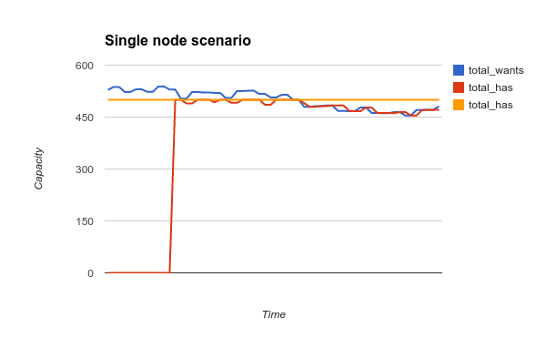
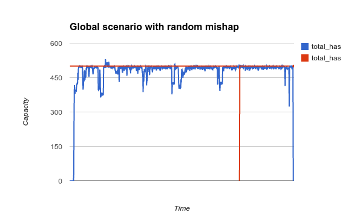
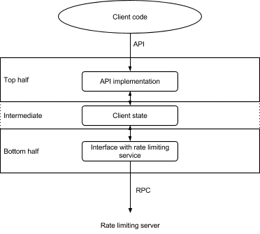

# Doorman: Global Distributed Client-Side Rate Limiting

Authors: Jos Visser <josv@google.com>, Ric Szopa <ryszard.szopa@gmail.com>

**Note**: This is the original Doorman design doc with references to internal Google products and services removed. Some protobuf definitions may be out of date, but the general ideas have not changed.

## Introduction

_In which I introduce the problem I want to solve.._.

Here is the problem I want to solve:

A set of distributed clients (some of which are more important than others) are using a shared resource with limited capacity. The clients need to share this capacity between them such that:

+  The clients get a rate limit from the system which they are then responsible for upholding.
+  Their combined traffic does not exceed capacity.
+  No capacity is left unused.
+  The available capacity is distributed fairly among the requestors (for some definition of fairness).

## Background

_In which I say something about why this is a problem that needs to be solved_.

At YouTube, we run various pieces of internal infrastructure with limited capacity that are used by internal and external users. To protect the limited capacity we use server side throttling.

Server side throttling works well as a defensive measure, but it is not without its problems:

1. There is a cost in sending and then rejecting requests. We have already burnt the network capacity and done some processing on the request.

1. Clients that have their queries rejected have no clue when to try again. The industry standard mechanism for dealing with this is retry with exponential backoff. This inevitably means that some capacity is left unused.

1. Most server side throttlers require statically distributing available capacity among clients (though some throttlers allow sharing unused capacity between clients who are overshooting their limit. A question with statically pre-partitioning the available capacity is whether every client can use their maximum quota simultaneously.

It is obvious that clients that do not want to have their queries rejected by server side throttling should rate limit themselves.

## Current tactics for client side rate limiting

_In which I describe what people do today if they want to rate limit themselves, and why these mechanisms do not suffice_.

Currently the authors of clients that use our infrastructure have only limited tools available to rate limit themselves.

### Job size manipulation

In some cases clients send requests to a shared service at an unbounded rate (meaning: at whatever rate they can generate them) and we manipulate the number of tasks in the client job to limit the aggregate rate at which they use the service. The obvious problem with this is that running N tasks, each of which can generate M(i) requests per second, can be totally fine one day but too much on another day, depending on environmental conditions such as the state of the network and the usage by other users of the service.

On quiet days the service might be able to support N+K tasks, for instance either because other users are not sending as much traffic or because ΣM(i) is lower than usual because of random fluctuations in the cloud computing environment). When this happens clients who rate limit themselves through job size manipulation are leaving unused capacity on the table and the client does not process data as fast as it potentially could. Then again on other days N tasks might generate too much traffic for the service, again depending on factors outside of the influence of the people responsible for configuring the production environment of our example client job.

### Local rate limiting

Another tactic is to use a local (task bound) rate limiter which limits the amount of traffic a single task can send. N tasks, each of them rate limited to M(i) requests per second will generate a maximum of the ΣM(i) requests per second. Like in the previous example this rate may be just right, too conservative, or too aggressive, based on external circumstances. Another problem with this approach is that if one task is operating at the rate limit (and throttling itself), whereas another task is not yet at its limit, the slack capacity in the second task is not allocated to the first task.

### Consequences

The current limited tactics available for rate limiting have one or more of the following effects:

+  Most people are too conservative in configuring their job (either limiting N, or locally limiting M(i)). This will leave unused capacity on the table, and many jobs and processes run slower than they actually could run. In some instances this has user visible repercussions because certain processes take longer than they should.

+  People manually try to optimize N or M(i) for the typical available capacity of the system. This works most of the time, but every now and then their limits are too aggressive and the system degrades, which leads to people getting paged.

+  People continually mess with N and M(i), trying to maximize their throughput. This is a lot of hassle and regularly goes wrong (which causes pages).

Unfortunately:

1. Experience has shown us that exponential back-off is a lost art
1. Retrying failed queries can, under circumstances, aggravate the problem.

## A system for global distributed client side rate limiting

_In which I give a high-level overview of the proposed system_.

The system I propose to design and build will apportion and distribute li	mited capacity for a resource or service to clients that want to use this capacity. The system is agnostic with respect to what this capacity represents. The system can be used to achieve two types of rate limiting:

1. Restrict some activity to a maximum frequency.
   Example: Limit an outgoing RPC to a maximum QPS (queries per second).

1. Only have a particular number of operations outstanding. Example: Only have a maximum number of open MySQL transactions in-flight simultaneously.

The system is cooperative. Clients that wish to use it should explicitly use the feature to control the rate at which they perform certain actions or the amount of concurrent actions outstanding.

In the proposed solution each client that wants to rate limit its usage of a shared resource (or service) requests and gets an individual capacity limit L from the system. The value of L for a client is dependent on:

+  The total global capacity: No more capacity will be handed out than is available.

+  The individual demand of this client (task): Clients will typically not get a higher limit than they request.

+  The total global demand: Clients might get a lower limit than they are asking for, based on global demand. The algorithms that do the sharing try to divide the available capacity “fairly”.

It is the client's responsibility not to overshoot the limit L. The system will provide patterns and libraries in various languages (Python, C++, Java, Go), that will allow a client to determine its need and to stay within the assigned limits.

Capacity and limits will be re-evaluated regularly by the system and new limits will be handed out to the clients.

## Architecture overview

_In which I give a high level overview of the architecture of the system_.

The proposed system for global distributed client-side rate limiting consists of the following components:

1. A client-side library (for C++, Python, Java and Go) which provides features for communicating with the rate limiting servers (see below) and for helping applications to uphold the limits received from these servers.  

1. A globally distributed set of rate limiting servers that communicate with the clients, receive all the requests for capacity, apportion the available capacity, and return capacity limits to the requesting clients.

The servers are organized in a hierarchical fashion: The clients communicate with so-called leaf rate limiting servers. The leaves talk to a set of parent servers which aggregate and apportion capacity at a lower level. The parents in their turn talk to root rate limiting servers which perform the same function one level lower in the tree. The system does not require this hierarchy, nor does it require the hierarchy to be three levels deep. The hierarchy can be one deep (only root servers) or be as deep as the production deployment requires.

The proposed three level hierarchy would allow for the following levels:

1. Leaf servers in each cluster.
1. Parent servers for each region.
1. Root servers globally.

The initial deployment will probably only contain root servers, and I can imagine that we won't grow beyond a two level hierarchy with leaves and root servers.

The clients contact their assigned servers to request a limit for a shared resource. The server responds with a limit L which is valid until a particular time T. This limit is in effect a lease on capacity. If it wants to continue using the resource the client needs to request a new (or changed) limit before its current lease expires. The client is encouraged to renew the limit before time T has come and gone. The protocol between the client and the server will be explained in great detail in an upcoming section.

A non-root rate limiting server apportions capacity based on a capacity for the resource that it itself gets from the lower level server using a protocol similar (but not identical) to the one the client is using. This mechanism for getting capacity from a lower level server goes all the way down to the root server, which gets its capacity for the resource from a configuration file stored in global configuration store.

**Note**: In case a resource is provided by a number of servers it is not the responsibility of the rate limiting system to prescribe load balancing among the instances. Existing load balancing technologies should be used for that.

## Root server configuration

_In which I explain how the root server knows the capacity for each resource and how to distribute it between the clients_.

The unit of protection is the “resource”. Resources have a maximum capacity, which is expressed as a positive floating point number. The interpretation of the capacity is up to the client and can for instance be a query per second, an in-flight database transaction, the number of items in a shared cache, or an abstract query cost. The system does not need to know what the capacity exactly represents, as long as the client and the servers implementing the resource agree on it.

Examples of a resource (in terms of the rate limiting system) are:

+  A [Vitess](https://github.com/youtube/vitess) transaction pool associated with a YouTube MySQL master shard. Clients can use a resource like this to limit the number of transactions that a client can have in-flight simultaneously.

+  A MySQL replica shard. The capacity could represent the number of queries per second sent to the shard, or perhaps (in case we implement a system of query cost calculation) a number of query cost units per second.

Each resource has a unique identifier which is used by the client when asking for capacity. This identifier is a human readable string which is otherwise opaque to the system. Existing identifiers like service names and MySQL shard names can be reused as resource identifiers.

The resource configuration is a protocol buffer. The protocol buffer format is as follows:

    // NamedParameter encapsulates a name/value pair which is used to
    // configure an Algorithm (see below).
    message NamedParameter {
      required string name = 1;
      optional string value = 2;
    }

    message Algorithm {
      enum Kind {
        NO_ALGORITHM = 0;
        STATIC = 1;
        PROPORTIONAL_SHARE = 2;
        FAIR_SHARE = 3;
      }

      required Kind kind = 1;

      // How long should the lease be, in seconds.
      required int64 lease_length = 2;

      // How many seconds should the client wait until refreshing its
      // lease.
      required int64 refresh_interval = 3;

      repeated NamedParameter parameters = 4;

      // By default the learning mode duration is the lease length,
      // however if you want to live dangerously, and assume that
      // clients are living up to their responsibility to contact
      // the server every refresh_interval, you can specify a shorter
      // learning mode here. You can also specify a longer learning
      // mode duration (longer than the lease length), but then you
      // are a muppet (or you do not trust the clients, in which case
      // you need to fix the client implementation).
      optional int64 learning_mode_duration = 5;
    }

    // ResourceTemplate is used to instantiate the actual configuration
    // for a resource based on a match with the identifier_glob glob.
    message ResourceTemplate {
      // Glob used to match actual resources.
      required string identifier_glob = 1;

      // Capacity in service units
      required double capacity = 2;

      // Algorithm used to divide capacity between clients.
      required Algorithm algorithm = 3;

      // Capacity to use in "safe" mode.
      // You can set this to a number and then the client will use that number
      // as the capacity in case it cannot refresh its lease.
      // If this field is absent the system returns a dynamic safe capacity in
      // the response, which is the available capacity divided by the number of
      // clients that the server knows about.
      optional double safe_capacity = 4;

      // Description of the resource.
      optional string description = 5;
    }

    // The resource configuration consists of a list of templates.
    message ResourceRepository {
      // List of ResourceTemplates specifying available resources. Order
      // of elements in this list is significant: it will be used to match
      // incoming requests. A template for * should be the last element.
      repeated ResourceTemplate resources = 1;
    }

**Note**: When locating the configuration entry of a resource the system will make two sweeps through the repository: The first looking for an exact match, and a second one the match by regular expression in case the exact match does not yield a result.

**Note**: In case the system cannot find a template to match the requested resource it will just honor whatever request the client has sent it. Instrumentation will be added to monitor/alert on this situation.

The algorithm field in the resource configuration protocol buffer is used to indicate which algorithm will be used to divide capacity between the clients. A number of algorithms will be supported initially. The param repeated field can be used to specify configuration parameters for the algorithm. Please see the chapter on “Algorithms” for more information.

## Server tree and discovery

_In which I describe how the rate limiting servers are distributed and discovered_.

The rate limiting servers are distributed in a tree. In the examples we will use a tree of depth three: leaves servicing clients, parents servicing a set of leaves and a root servicing the parents. The purpose of this tree is to divide capacity globally between a set of clients without creating a global hot spot that all clients need to talk to.

In the examples the leaf servers service one or more clusters and the parents are distributed regionally, servicing two or more leaves.

**Note**: The production deployment can be set up differently. In in the initial deployment we can have only root servers for instance

Each rate limiting server can service both clients and servers at a higher level in the tree. Rate limiting servers at a higher level in the tree (like the leaves) aggregate the total demand of their clients in their own requests for capacity from the lower level server. In this model clients request capacity for themselves and servers request capacity on behalf of all their clients. The root distributes capacity to its clients based on the configured capacity.

Each node in the server tree is formed by a rate limiting server job consisting of a number of tasks. These tasks use a master election mechanism to elect one among them to be the active server for that node. The winner of the master election will be the task that services all requests for capacity from that node. If a non-master task gets a request if will respond with the address of the master, so that the client knows who to talk to.

The rate limiting server will be written so that it can handle at least 1,000 QPS of requests from clients or upstream servers. Given that I will be proposing later that each client contacts its leaf server once every eight seconds this means that a single rate limiting server will be able to handle about 8,000 clients. This should suffice for the foreseeable future. If at one point we have more clients than that we can increase the depth of the tree.

The root node is a bit special: It will consist of three jobs in different zones that will elect a single master from all the nine tasks in the three jobs.

## Handling cluster unavailability

Provided that every non-root level in the tree has at least three nodes in different zones the server tree is resilient against PCRs and other cluster outages:

+  The root node will be split across three clusters in different PCR zones, so provides N+2 availability  

+  Clients that are already talking to a node when a drain comes in effect can continue to talk to that node. The fact that a cluster is drained does not necessarily cause the servers in that cluster to stop functioning. In fact the only dependency of a rate limiting server is on its lockservice (ZooKeeper, Etcd) cell for master election. As long as a node can talk to a lower level server and to the lockservice it can function.

+  Because clients and servers lease capacity from the lower level server capacity held by clients or servers in a cluster that goes offline will automatically expire after the lease runs out.

## Client operation

_In which I describe how clients should behave when they request capacity from the server_.

## Client identifier

Every client has a unique client id that distinguishes this client from all the other potential clients out there. The client id will be formed from the fully qualified hostname of the machine followed by a colon and a unique identifier such as the process identifier or a TCP port number.

## Lease

The core concept in the rate limiting server is the capacity lease:

    // Encapsulates a lease on capacity with a start\_time and expiry\_time in seconds
    // since the epoch.
    message Lease {
      required int64 expiry\_time = 1;
      required int64 refresh\_interval = 2;
      required double capacity = 3;
    }

A Lease protocol buffer describes a lease on a resource. It contains the expiry\_time of the lease (in seconds since the epoch). The lease is valid until the expiry\_time, but clients are requested (strongly) to contact the rate limiting server every “refresh\_interval” seconds to update their leases.

## Client state

Every client maintains an internal state of all the resources it is talking to, the capacity it has obtained for these resources, and the time when that capacity expires. This internal state can be thought of as a protocol buffer of the following type:

    // The state a client needs to keep for every resource it wants to talk to.
    message ClientResourceState {
      required string resource_id = 1;
      required int32 priority = 2;
      optional Lease has = 3;
      optional double safe_capacity = 4;
      required double wants = 5;
    }

    // The client state consists of a list of resource states.
    message ClientState {
      required string client_id = 1;
      repeated ClientResourceState resource = 2;
    }

**Note**: This protocol buffer representation of the client state is conceptual. The client implementation may store this state differently, for instance to speed up access or to facilitate locking. The rate limiting simulation described in an upcoming section uses this protocol buffer for the client state.

The priority field in the resource state indicates the priority of this client with respect to the resource. The interpretation of the priority is up to the algorithm specified in the resource configuration. Some algorithms may ignore the priority entirely. The priority is set initially when the client library creates the resource state entry, but may from that point on only be modified by the server as a result of a GetCapacity RPC.

When the lease expires the client should remove the capacity and lease fields and behave as if no capacity is available.

## Optimistic, pessimistic and safe mode operation

When a client fails to obtain or renew capacity it can do three things:

1. In pessimistic mode it can behave as if a capacity of zero has been granted, and effectively stop using the resource. This is obviously safest, but could halt all resource usage if the rate limiting system is temporarily unavailable. This is right course of action for an off-line batch job or daemon which is not interacting with users.

1. In optimistic mode it can behave as if it got all of the capacity it requested. This means that it can continue to use the resource, but there is a danger that the resource will be overused. This is the right course of action for on-line components that interact with users and with resources that are protected against overloading by other means.

1. In safe mode the client is allowed to use the resource up to the per-client safe capacity limit of the resource. The safe capacity is configured in the resource template and returned as part of every request for capacity. If the safe capacity is not configured in the resource template the server calculates a dynamic safe capacity (the available capacity divided by the number of clients) and returns that as the safe capacity to use.

**Note**: Which mode the client operates in depends on a client library flag.

## Discovering the server

A client needs to find the current Doorman master to talk to. It can do this in two ways:

1. Using an explicity Discovery RPC  

1. Just sending a GetCapacity RPC and processing the master\_address field in the response.

The Discovery RPC is the preferred mechanism, but client library authors are free to use whatever method the want.

### Using the Discovery RPC

The Discovery RPC can be sent to any Doorman server at a given level in the server hierarchy to find the master at that level:

    // The request to obtain the master's address.
    message DiscoveryRequest {
    }

    // This message type is used when the server wants to convey the
    // address of a master. If the the optional master_address field
    // is not there that means that the server wants to tell us who
    // the master is, but it doesn't know.
    message Mastership {
      optional string master_address = 1;
    }

    // The response containing the master's address.
    message DiscoveryResponse {
      required Mastership mastership = 1;
      required bool is_master = 2;
    }

The response should be interpreted as follows:

+  If is\_master equals true, the server that answered the RPC is the master. The mastership message contains the address of the master. It is a semantic error for is\_master to be true and for master\_address to be absent.  

+  If is\_master equals false the mastership message might contain the address of the master. If it doesn’t (optional field) then the server doesn’t know who the master is, and the Discovery needs to be retried.

## Requesting capacity

Clients that want to request capacity from the system first need to locate the master of the nearest leaf node. The client sends  a GetCapacity RPC. If the node they got assigned to is the master, then they receive it and progress normally. Otherwise, they receive the address of the current master, and have to connect to it (see below). To get capacity for resources the client sends a GetCapacity RPC to the server.

This RPC is a bulk request that can request capacity for more than one resource. The client is invited to always send a GetCapacity request for all the resources in its internal state, but may elect to request capacity for a subset of these resources.

The GetCapacity request takes the following protocol buffer as its argument (from “protocol.proto”):

    // Encapsulates the information we need to send to get capacity for a
    // single resource.
    message ResourceRequest {
      required string resource_id = 1;
      required int64 priority = 2;
      optional Lease has = 3;
      required double wants = 4;
    }

    // The GetCapacityRequest contains the identifier of the client making
    // the request and a list of single resource capacity request protocol
    // buffers.
    message GetCapacityRequest {
      required string client_id = 1;
      repeated ResourceRequest resource = 2;
    }

Apart from the client identifier this message contains a list of single resource capacity requests. For a new request this request contains only the requested new capacity (wants), but none of the other optional fields. For repeated requests for the same resource the single resource capacity request also contains the current capacity the client has for the resource (has) and the current lease.

The response is a protocol buffer of the following type (from “doorman.proto”):

    // Contains the capacity allocated by the server for a single
    // resource.
    message ResourceResponse {
      required string resource_id = 1;
      required Lease gets = 2;
      optional double safe\_capacity = 4;
    }

    // The response to a GetCapacity request is a list of protocol buffers
    // specifying the capacity for a single resource.
    message GetCapacityResponse {
      repeated ResourceResponse response = 1;
      optional Mastership mastership = 2;
    }

As said earlier, the server will return a capacity only if it is the master node. Otherwise, it will return mastership information, and the client needs to connect to the master. If there’s no master at the time of the request (for example because a master election is in progress), master\_address in the mastership message will be empty, and the client is expected to retry.

The client needs to update its internal state from the GetCapacityResponse and from that point on regulate its usage of the resource not to exceed the new limit. If any of the resources in the request is not present in the response that means that the resource configuration was modified and no longer contains a template that matches the resource. Eventually the capacity lease will run out. How to handle this situation is described in the section on lease expiration below.

Clients should reissue GetCapacity requests for a resource depending every “refresh\_interval” seconds. If that call returns information that a new master was elected, the client should immediately send a GetCapacity RPC to the new master. Failures can be ignored and the client can retry in another “refresh\_interval” seconds.

Clients are allowed to send GetCapacity requests before the refresh interval has expired. Good reasons to do so are:

1. The capacity needed for a resource has changed significantly and the client wants to update its capacity lease right now.

1. The client wants to obtain capacity for a new resource and decides to renew its capacity for the other resources in its internal state as well (this behaviour is encouraged).

That said a client may not send more GetCapacity requests for a given resource than once every five seconds. If it does send a request for capacity for a resource inside of five seconds since the last request it is silently ignored.

## Lease expiration

When the capacity lease expires a client should update its internal state, capacity, and lease fields. From this moment on the behaviour of the client with respect to the resource is determined by whether the client is configured to behave in optimistic, pessimistic or safe mode (see section above).

## Release resources

If a client no longer wants to talk to a resource it can release it with the ReleaseCapacity RPC (from “protocol.proto”):

    message ReleaseCapacityRequest {
     required string client_id = 1;
     repeated string resource_id = 2;
    }

    message ReleaseCapacityResponse {
      optional Mastership mastership = 2;
    }

If the ReleaseCapacity RPC ends in an error the client can ignore this error. If the response contains information about a new master, the client should retry the RPC with the new master. If a client crashes the server will automatically forget about the client when all of its leases expire.

## Server operation

_In which I describe how the server operates when it gets a requests from the clients_

A rate limiting server acts as a server for clients and servers higher in the tree and acts as a client in order to get capacity from a lower level server (with the exception of the root server, which has no downstream server). The server is configured (through a flag) with the address of the lower level server it needs to get capacity from itself.

Each server loads the global resource configuration from CDD.

## Server identifier

Like a client every server has a server identifier. This identifier is similar to the client identifier discussed in the chapter on client operation and is determined in the same way.

## Master Election

The server participates in a master election with the other servers that make up the node. Normally speaking that would be the other tasks in the job that makes up the node, but for the root node the election is between the tasks in all the jobs (in three different zones) that make up the root node (see the chapter on the server tree earlier in this document).

If the server loses the election:

+  Its responses to any RPCs should only contain the mastership field, redirecting the clients to the new master.
+  It needs to delete the entire internal server state.

If the server wins the election:

+  It needs to create a new empty internal server state.

## Server state

The server keeps the following state:

    // This protocol buffer encapsulates the state a server maintains for a client/resource
    // combination. Note: This is for actual clients, not for rate limiting servers at
    // a higher position in the server tree.
    message PerClientResourceState {
      required string client_id = 1;
      required int32 last_request_time = 2;
      required int32 priority = 3;
      optional CapacityLease has = 4;
      required double wants = 5;
    }

    // This protocol buffer encapsulates the state a server maintains for a single resource
    // and a higher level server (a server at a higher level in the server tree that uses
    // this server to get capacity on behalf of its clients). The state consists of a list
    // of aggregated client needs per priority band.
    message PerServerResourceState {
      required string server_id = 1;
      required int32 last_request_time = 2;
      optional CapacityLease has = 3;
      required double outstanding = 4;
      repeated PriorityBandAggregate wants = 5;
    }

    // This protocol buffer encapsulates the server state for a single resource
    message ServerPerResourceState {
      required string resource_id = 1;
      required int32 learning_mode_expiry_time = 2;
      required ResourceTemplate template = 3;
      optional CapacityLease has = 4;
      repeated PerClientResourceState client = 5;
      repeated PerServerResourceState server = 6;
    }

    // The server state object contains a list of state per resource that the server has
    // been asked about.
    message ServerState {
      required string server_id = 1;
      required int32 server_level = 2;
      optional int32 election_victory_time = 3;
      repeated ServerPerResourceState resource = 4;
    }

The “PriorityBandAggregate”  looks like this:

    message PriorityBandAggregate {
      required int32 priority = 1;
      required int32 num_clients = 2;
      required double wants = 3;
    }

**Note**: This protocol buffer representation of the server state is conceptual. The server implementation may store this state differently, for instance to speed up access or facilitate locking.

The lease the server maintains in the ServerResourceState reflect the status of this server as a client of the downstream server. The ease information in the PerClientResourceState and PerServerClientResourceState objects reflect the information that this server handed out to these clients and servers.

## Processing the GetCapacity RPC

When the server receives a GetCapacity RPC it goes through the following steps for every single resource request in the RPC:

### Step 1: Cleanup step

In the cleanup step the server goes through the internal state removes all entries of which the lease has expired.

Notes:

+  This cleanup operation can be done at any time, but it is convenient to do it now.

+  Since a server will never hand out a lease on capacity that is longer than its own lease on the capacity it got from a lower level server it can assume that an expired lease on its own capacity for a resource means that all leases of clients and servers that got capacity from it have also expired.

+  Since all times are maintained in seconds, the server only has to perform a cleanup if one hasn’t been done yet in the current (second granularity) timestamp. This provides for a simple optimization.

+  Resources which are in learning mode (see below) are exempt from cleanup, since they might not have obtained a capacity yet from a downstream server.

### Step 2: Insertion step

In this step the server inserts the request information in its internal state unless the client has requested capacity for this same resource less than five seconds ago, in which case the state is not inserted and the subsequent steps are not executed. This also means that the response will not contain capacity for this resource.

**Note**: If the resource is not in learning mode (see below), it is an error for a request to come in with a “has” field in it without there being a record of this client/resource in the server's internal state. In that case the server logs an error but proceeds with handling the request.

### Step 3: Determining the new capacity

In case the request came in while the resource is still in learning mode (see below) the server asks the algorithm to create a new CapacityLease for the requester with the capacity field set to the same to the same value as the current capacity (from the “has” field in the request) or zero if the request does not have a current capacity.

If the resource is not in learning mode anymore the server runs the algorithm selected for the resource on its internal state. The output of the algorithm is a new CapacityLease for the client.

For more information on how algorithms perform please check the chapter on “Algorithms” below.

**Note**: If this server does not have any capacity available for a resource (the capacity and lease fields in the ServerPerResourceState objects are absent) it behaves as if a capacity of zero is available. This can happen if either the server has not yet gotten any capacity for the resource yet (recently won the master election) or if the server lost the lease on its current capacity.

### Step 4: Response step

In the last step the server creates the GetCapacity response protocol buffer for this resource request and inserts it into the response protocol buffer. It also updates the last\_request\_time field for the client.

### On learning mode

The server does not store its internal state on a durable medium and also does not replicate it to the runners-up in the election process. This means that when a server wins the election it has a clean internal state and it has no idea what leases are out there. It means also that it cannot safely give out capacities until it has rebuilt its internal state. Fortunately every client and higher level server must contact this server regularly in order to get new capacity leases, and the server can use this to rebuild its internal state. This phase of rebuilding the internal state for a resource is called “learning mode”.

When a resource is in learning mode it knows that it cannot run its algorithms to hand out capacity, on the other hand it also knows that the current allocation of resources most probably reflects a valid apportioning of capacity among the clients. So while in learning mode the server just records the information provided by the clients in its internal state and hands out the same capacity back to the client. If the request does not have a “has” field this means that this request is from a new client or from a client with expired capacity. Unfortunately the only way the server can deal with this is handing out a capacity of zero to the new client. The lease of the new capacity is set by the algorithm selected for the resource (by the configuration) by asking it to create a default lease with the provided capacity.

Whenever the server creates a new ServerPerResourceState object in its internal state it determines the learning\_mode\_expiry\_time for this resource by asking the resource's algorithm for the maximum lease duration it will ever hand out for this resource. The learning\_expiry\_time is the server's election\_victory\_time plus that maximum lease duration.

## Processing the ReleaseCapacity RPC

Handling the ReleaseCapacity RPC is as simple as removing all information about the client/resource combinations in the request from the server's internal state.

## Getting capacity for the server

The server needs to have capacity per resource to hand out to the clients (as apportioned by the algorithm). The capacity the server has for a resource is reflected in the “capacity” field of the ServerPerResourceState object in the server's internal state.

For a server in the root node the capacity that is available for a resource is determined by the resource template for the resource (the “capacity” field of the ResourceTemplate object).

**Note**: We should hand out a “normal” lease on capacity in the root server (including a refresh interval), as this enables the capacity in the global configuration to be changed (through a CDD push).

Servers in non-root nodes need to request capacity from a lower level server through the GetServerCapacity RPC. Like clients, servers use the Discovery RPC to find the master server in the lower level node.

### The GetServerCapacity RPC

The GetServerCapacity RPC request asks the lower level server for capacity on behalf of all the server's clients (both actual clients and higher level servers). The request object contains a list of request for multiple resources, and for each resource the request contains aggregate information about all the clients per priority band:

    message ServerCapacityResourceRequest {
      required string resource_id = 1;
      optional CapacityLease has = 2;
      required double outstanding = 3;
      repeated PriorityBandAggregate wants = 4;
    }

    message GetServerCapacityRequest {
      required string server_id = 1;
      repeated ServerCapacityResourceRequest resource = 2;
    }

The server needs to condense its entire internal state for a resource (both the information it keeps for individual clients and the information it keeps for higher level servers that use this server to get their own capacity) into a GetServerCapacity request.

The response to this request has the following format:

    message ServerCapacityResourceResponse {
      required string resource_id = 1;
      required CapacityLease gets = 2;
    }

    message GetServerCapacityResponse {
      repeated ServerCapacityResourceResponse resource = 1;
      optional Mastership mastership = 2;
    }

The server copies the capacity and lease back to its internal state and uses that information in handing out capacity to its clients and higher level servers.

### Processing the GetServerCapacity RPC

GetServerCapacity RPC are handled in exactly the same way as GetCapacity RPCs.

## Miscellaneous

+  Probably needless to say, but care must be taking to implement appropriate locking around the server's internal state, especially with respect to:
   +  Concurrent processing of RPCs
   +  Updates of the configuration in CDD  

+  It might be worth considering to implement the part of the server which runs the algorithm in a round-oriented way. In that case several in-flight RPCs modify the internal server state and then wait for the next round of the algorithm to run, after which they retrieve the results. This might lead to the entire system converging faster to a steady state.

## Algorithms

_Where the problem of how to actually distribute limited capacity to clients is side-stepped :-)_

In the terminology of this design doc algorithms are responsible for processing the internal server state and figuring out how to divide the available capacity among the clients and higher level servers. The system can support multiple algorithms. Each algorithm can be parameterized through named parameters to guide its execution (see the section on the configuration earlier in this document).

The main function of an algorithm is to calculate the distribution of available capacity over the clients and higher level servers that are requesting capacity from this server. On top of that an algorithm has two features which are needed during learning mode:

+  Can create a lease based on a given capacity.
+  Can return the maximum lease time it will ever give out for a resource.

The calculation function of an algorithm takes as its argument a resource identifier and a server or client identifier. This function then calculates what the client or server requesting the capacity should get and creates a new CapacityLease for the client or higher level server.

Some remarks about this:

+  When creating the new lease it is entirely possible that the requestor cannot get the full capacity it is entitled to because the other clients of this server still have leases.. In that case the algorithm should assign the maximum capacity it can give without overshooting the available capacity (taking all the “has” capacities into account.

+  If there is enough capacity available the requestor might get more than it asked for, at the algorithm’s discretion. For instance it could be useful to give a server more capacity than it needs so that it can react faster to new or spiking clients.

+  The algorithm should never create a new lease that lasts longer than the lease that this server has on the capacity.

+  For reasons of convergence the refresh interval of a lease should halve with every level we go up in the tree.

## Finding the algorithm to use

Each ResourceTemplate in the configuration can specify an algorithm to use for all resources that match this template. If a resource template does not contain an algorithm the configuration uses the (mandatory) default algorithm.

If the server cannot instantiate the algorithm (for instance because of an unknown algorithm name or a non-correctable error in the algorithm's parameters) it will instantiate the “None” algorithm for the resource. This situation will be logged and exported to the monitoring system so that suitable alerts can be generated.

## Common algorithm parameters

Each algorithm in this document supports the following parameters:

<table style="border:1px solid #000000;border-collapse:collapse;">
<tbody>
<tr>
<td style="padding:5px;"><b>Parameter name</b> 
</td>
<td style="padding:5px;"><b>Type</b> 
</td>
<td style="padding:5px;"><b>Default</b> 
</td>
<td style="padding:5px;"><b>Description</b> 
</td>
</tr>
<tr>
<td style="padding:5px;">lease_duration_secs 
</td>
<td style="padding:5px;">int32 
</td>
<td style="padding:5px;">60 
</td>
<td style="padding:5px;">The length of the lease issued by servers for this resource. 
</td>
</tr>
<tr>
<td style="padding:5px;">decay_factor 
</td>
<td style="padding:5px;">double 
</td>
<td style="padding:5px;">0.5 
</td>
<td style="padding:5px;">The factor with which the refresh interval decays every time we go up one level in the server tree. 
</td>
</tr>
<tr>
<td style="padding:5px;">refresh_interval 
</td>
<td style="padding:5px;">int32 
</td>
<td style="padding:5px;">16 
</td>
<td style="padding:5px;">The refresh interval after which clients are supposed to refresh their leases. 

<b><i>Note</i>:</b> This interval degrades by the decay_factor when we go up the server tree. 
</td>
</tr>
</tbody>
</table>

## Available algorithms

Initially the following algorithms will be implemented:

### The “None” algorithm

This algorithm is actually the absence of an algorithm. It simply assigns each requestor exactly the capacity it wants, even ignoring the possibility that it might overshoot the totally available capacity.

**Note**: This is the default algorithm in case the server cannot instantiate either the algorithm specified in the ResourceTemplate for the resource or the default algorithm.

### The “Static” algorithm

This algorithm gives each requestor the same statically configured capacity.

### The “ProportionalShare” algorithm

From the implementation:

    // ProportionalShare assigns to each client what it wants, except
    // in an overload situation where each client gets at least an equal
    // share (if it wants it), plus (if possible) a share of the capacity
    // left on the table by clients who are requesting less than their
    // equal share proportional to what the client is asking for.

### The “FairShare” algorithm

From the implementation:

    // FairShare assigns to each client a "fair" share of the available
    // capacity. The definition of "fair" is as follows: In case the total
    // wants is below the total available capacity, everyone gets what they want.
    // If however the total wants is higher than the total available capacity
    // everyone is guaranteed their equal share of the capacity. Any capacity
    // left by clients who ask for less than their equal share is distributed
    // to clients who ask for more than their equal share in a way so that
    // available capacity is partitioned in equal parts in an iterative way.
    // Please check the documentation for examples.

## Convergence and shortfall

_Where I discuss some essential elements of the capacity distribution.._.

An important aspect of the system here is convergence: How fast does the system converge on a stable state which hands out as much as the capacity as possible, without overshooting the maximum capacity.

Below is a graph of the first simulation scenario. In this scenario:

+  There is one node in the server tree (a root node).
+  There is 500 capacity to give out.
+  There are five clients. Each wants 100 capacity initially, but starts varying requested capacity randomly

As you can see in this chart the total\_wants and total\_has of the clients track each other quite closely, and the total\_has of the clients does not overshoot the total\_has of the server (the yellow line).

Secnario seven shows convergency in a more complicated tree wth a root node, three regions, three datacenters per region, and 5 clients per datacenter. This means 45 clients overall. They start by asking 14 capacity each and then randomly fluctuate their demand. During the run a number of random mishaps happen, such as spiking clients (adds 100 to the requested capacity), failing servers et cetera. The simulation runs for an hour:

The red line shows the total available capacity at the root node (500). The drop happens during a simulated server crash. The blue line is the total capacity handed out to clients. After a major shift in demand somewhere on the planet it takes the system a max of 2 minutes to catch up again and hand out all the capacity. On average in this simulation the system hands out 96.6% of all available capacity (after the initial startup learning mode). In a similar scenario (scenario five) without random mishap the system hands out on average 96.8% of available capacity.

## Shortfall

As you can see from the graph there are a number of cases where the capacity handed out by the system rises above the capacity limit. We call this phenomenon “shortfall”.

The reason for shortfall is that when a server asks for a capacity from its downstream server it can potentially get a new capacity which is less than it currently has in outstanding leases to clients and upstream servers. During that situation (which will have corrected itself in a single refresh interval) that server has given out more capacity than it currently has. Shortfall is more likely to happen in situations where the system is operating near maximum capacity and there is a sudden spike in capacity somewhere in the tree. When this happens the system has to rebalance itself and during that rebalancing shortfall occurs.

In the simulation run above:

+  Shortfall occurred 14 times
+  The maximum capacity handed out was 530.24 (106.05%)
+  The average over capacity situation was 509.99 (102%)

Combatting shortfall would mean changing the system in a way which also slows down convergence. We looked at a number of ways of doing that, but each of them has a large impact on convergence. Overall we feel that the problem of shortfall is not very critical for the following reasons:

1. It happens only in extreme situations
1. For many resources the configured maximum capacity is not a hard limit.
1. The amount with which is the maximum is potentially overshot is not extreme.

## Client library

_On how to make the life of the clients easy…_

The Stubby interface to the rate limiting system is quite simple. For reasons of simplicity and uniformity we will develop a client library which exposes a simple interface to the client code and which takes care of the protocol interactions with the rate limiting system.

## API

Two different APIs will be exposed. One for resources where the available capacity represent a rate (in Hz, like a qps) and one for resources where the capacity represents a gauge (like a maximum number of in-flight transactions).

For rate resources the API (example in C++) looks like this:

<table style="border:1px solid #000000;border-collapse:collapse;">
<tbody>
<tr>
<td style="padding:5px;">RateResource resource(“resource0”); 

while (something) { 
  resource.Wait() 
  // Execute transaction 
} 
</td>
</tr>
</tbody>
</table>

Some comments:

+  Multiple creations of a RateResource create only one underlying real resource. Reference counting will be used to know when to execute the ReleaseCapacity RPC.

+  The Wait() method waits until we can execute the next query. Queries are not evenly spaced in the second, but when the budget for this second has been used up, the caller is blocked until the new second starts.

+  Method will be added to set the required capacity. Once the system is in use the library will use the timings and counts of the call to Wait() to figure out the capacity that this client wants/needs.

For gauge resources the API looks like this:

<table style="border:1px solid #000000;border-collapse:collapse;">
<tbody>
<tr>
<td style="padding:5px;">GaugeResource resource(“resource1”); 

while (something) { 
  …  
  resource.Mark(); 
  // Execute transaction 
  resource.Release(); 
  …  
} 

while (something) {
     UnderGaugeResource x(&resource); 
  // Execute transaction 
} 
</td>
</tr>
</tbody>
</table>

Some comments:

+  There will be a method to set the initially required capacity. The Mark() and Release() methods will use the timings and counts of calls to Mark() and Release() to determine the required capacity...

+  In case of long running transactions there is a higher risk of shortfall (see previous chapter).

## Top and Bottom Halves

The client library will consist of two layers with an intermediate data structure. The top half gets called by the client code, whereas the bottom half communicates with the rate limiting system. The client state lives in the grey zone between the two layers, and gets updated by both halves:

