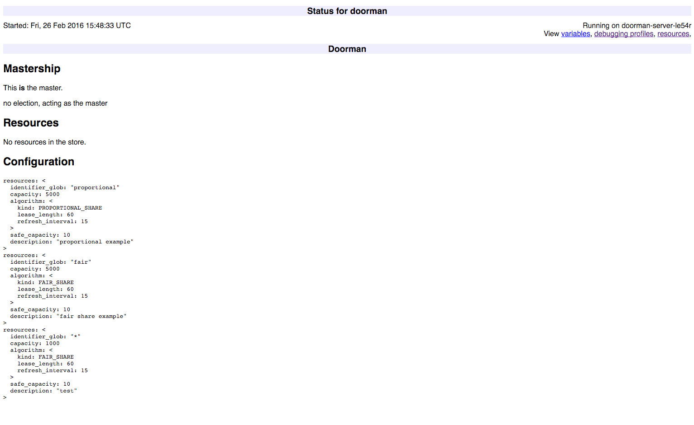
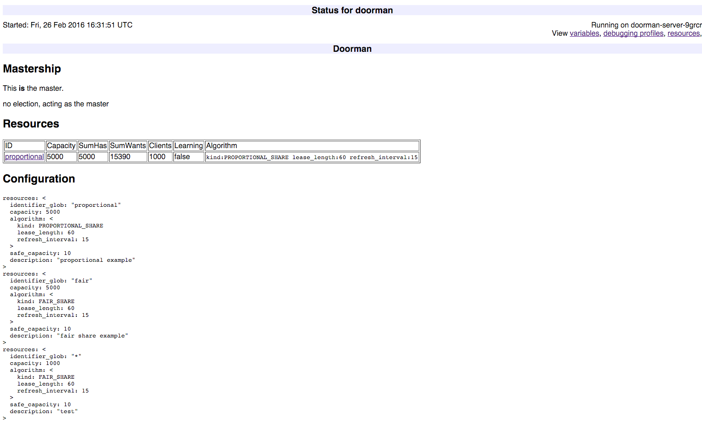
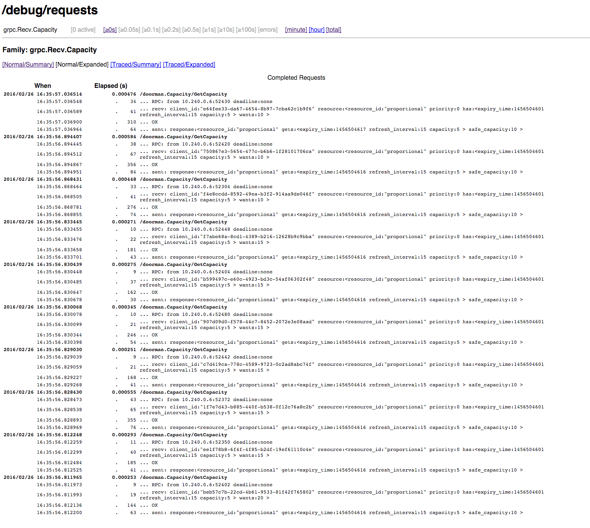
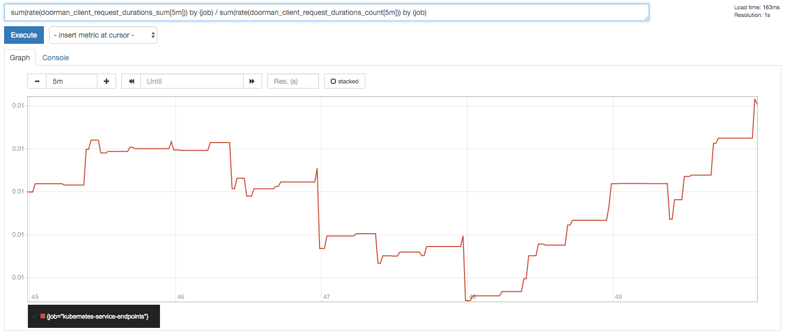

# GKE Load Test Tutorial

In this tutorial, we are going to set up a Doorman deployment similar to what you may expect to run in a production environment. The resource that Doorman will be protecting isn't all that useful (it's one of the Go examples for gRPC, the [Greeter](https://github.com/grpc/grpc-go/blob/master/examples/helloworld/helloworld/helloworld.proto) service), but that doesn't change the fact it's a real RPC service that may have limited capacity. Finally, we'll add some monitoring for good measure. 

To make this slightly more manageable, we'll do all of this in a Kubernetes cluster running on GKE (Google Container Engine). It should be simple to replicate the experiment with a Kubernetes cluster running on your own machines, and relatively easy to replicate it using some other cloud setup.

## Dramatis Personae

Our deployment will consist of the following elements:

 - Doorman Server - the standard Doorman server.
 - `target` - an RPC server.
 - `client` - a client for `target` which uses Doorman to avoid overloading it.
 - [Prometheus](http://prometheus.io/) - a monitoring system. We'll use it to get insight into the running system.

`target` and `client` are custom written for this tutorial. Let's take a closer look at them.


### `target`

[Target](docker/target/target.go) is an extremely simple gRPC server. Here is its `main` function:
```go
func main() {
	flag.Parse()
	lis, err := net.Listen("tcp", fmt.Sprintf(":%v", *port))
	if err != nil {
		log.Exitf("failed to listen: %v", err)
	}

	http.Handle("/metrics", prometheus.Handler())
	go http.ListenAndServe(fmt.Sprintf(":%v", *debugPort), nil)
	s := grpc.NewServer()
	pb.RegisterGreeterServer(s, &server{})
	s.Serve(lis)
}
```

We listen on two ports: one for gRPC, the other for HTTP, which we will use for monitoring.

`server` is similarly unexciting:

```go
// server is used to implement helloworld.GreeterServer.
type server struct{}

// SayHello implements helloworld.GreeterServer
func (s *server) SayHello(ctx context.Context, in *pb.HelloRequest) (*pb.HelloReply, error) {
	requests.WithLabelValues(in.Name).Inc()
	return &pb.HelloReply{Message: "Hello " + in.Name}, nil
}
```

A last thing worth noting is requests, which is a Prometheus counter. We will use it to monitor the number of requests that `target` is actually getting.

### `client`

`client` has one task: Send RPCs to `target`. Each process simulates some number of Doorman clients. This is necessary to make scheduling on a small Kubernetes cluster easier. In a real world setting, you would usually have one Doorman client per process.

```go
func main() {
	flag.Parse()
	log.Infof("Simulating %v clients.", *count)
	for i := 0; i < *count; i++ {
		id := uuid.New()
		log.Infof("client %v with id %v", i, id)

		client, err := doorman.NewWithID(*addr, id, doorman.DialOpts(grpc.WithInsecure()))
		if err != nil {
			log.Exit(err)
		}
		defer client.Close()

		res, err := client.Resource(*resource, *initialCapacity)
		if err != nil {
			log.Exit(err)
		}

		go manipulateCapacity(res, *initialCapacity, id)

		conn, err := grpc.Dial(*target, grpc.WithInsecure())
		if err != nil {
			log.Exitf("did not connect: %v", err)
		}
		defer conn.Close()

		c := pb.NewGreeterClient(conn)
		rl := ratelimiter.NewQPS(res)

		for i := 0; i < *workers; i++ {
			go func() {
				ctx := context.Background()
				for {
					if err := rl.Wait(ctx); err != nil {
						log.Exitf("rl.Wait: %v", err)
					}

					ctx, cancel := context.WithTimeout(ctx, 30*time.Second)
					if _, err := c.SayHello(ctx, &pb.HelloRequest{Name: *resource}); err != nil {
						log.Error(err)
					}
					cancel()
				}
			}()
		}
	}
	http.Handle("/metrics", prometheus.Handler())
	http.ListenAndServe(fmt.Sprintf(":%v", *port), nil)
}

```

The client uses a Doorman rate limiter and when the `Wait` method returns, performs the RPC.

The function `manipulateCapacity` changes the capacity requested by a client in a random way:

```go
func manipulateCapacity(res doorman.Resource, current float64, id string) {
	clientRequested := new(expvar.Float)
	for range time.Tick(*interval) {
		r := rand.Float64()
		log.V(2).Infof("r=%v decreaseChance=%v increaseChance=%v", r, *decreaseChance, *increaseChance)
		switch {
		case r < *decreaseChance:
			current -= *step
			log.Infof("client %v will request less: %v.", id, current)
		case r < *decreaseChance+*increaseChance:
			log.Infof("client %v will request more: %v.", id, current)
			current += *step
		default:
			log.V(2).Infof("client %v not changing requested capacity", id)
			continue
		}
		if current > *maxCapacity {
			current = *maxCapacity
		}
		if current < *minCapacity {
			current = *minCapacity
		}
		log.Infof("client %v will request %v", id, current)
		if err := res.Ask(current); err != nil {
			log.Errorf("res.Ask(%v): %v", current, err)
			continue
		}
		clientRequested.Set(current)
		requested.Set(id, clientRequested)
	}
}
```

Again, we are exposing an HTTP port and exporting metrics (we will use them to find the client latencies). 

### Doorman Server

This is the the regular [doorman server](https://github.com/youtube/doorman/tree/master/go/cmd/doorman), whose address we will give to the client. The way we'll run the server differs significantly from how we would run it in a real world setting. We are running just one process. If it dies, the client won't be able to get new resource leases. For production, we would run 3 processes, and they would use [etcd](https://github.com/coreos/etcd/) to elect a leader among themselves. We are skipping this step for the sake of simplicity.

## Kubernetes

[Kubernetes](http://kubernetes.io/) allows you to run Docker instances in a cluster. The great part about it is that it allows you to view all your containers as a single system. If you want to learn more about Kubernetes, please take a look at its [documentation](http://kubernetes.io/v1.1/examples/guestbook/README.html).
### Kubernetes in less than a minute

Assuming that you have some idea what Kubernetes is about, here's a quick refresher.

- All processes run in Linux containers (Docker being the most popular container solution).
- A *pod* is a group of containers that get scheduled together.
- A *replication controller* makes sure that a specified number of replicas of some pod are running at any given point. It is important to remember that pods running under a replication controller are [cattle, not pets](http://www.theregister.co.uk/2013/03/18/servers_pets_or_cattle_cern/). You are not supposed to concern yourself with a single pod. It may get killed, rescheduled, etc. They have names, but they are randomly generated, and you refer to them mostly when debugging an issue.
- A *service* abstracts away the problem of referring to pods. You specify some constrains that the pods have to meet, and the service gives you a port which you can use to connect to a pod of the specified type. It also acts as a load balancer.

## Creating a cluster

This part of the tutorial is specific for GKE. You should be able to adapt it reasonably well for [AWS](http://kubernetes.io/v1.1/docs/getting-started-guides/aws.html) or [Azure](http://kubernetes.io/v1.1/docs/getting-started-guides/coreos/azure/README.html)

I am assuming that you've installed [gcloud CLI](https://cloud.google.com/container-engine/docs/before-you-begin#install_the_gcloud_command_line_interface), and you have a Cloud project set up. You should also do 

```console
$ gcloud config set project PROJECT_ID
$ gcloud config set compute/zone us-central1-b
```

to save yourself from some typing.

Let's create a cluster. Run something like
```console
$ gcloud container clusters create doorman-loadtest --machine-type=n1-standard-1 --num-nodes=6
```

depending on how big you want your toy cluster to be.

## Docker images

Now, let's create the Docker images that we will use to run our services. I am assuming that you are in Doorman's main directory.

```console
$ docker build -t gcr.io/google.com/doorman/doorman-server:v0.1.7 doc/loadtest/docker/server/
$ docker build -t gcr.io/google.com/doorman/doorman-client:v0.1.7 doc/loadtest/docker/client/
$ docker build -t gcr.io/google.com/doorman/target:v0.1 doc/loadtest/docker/target/
$ docker build -t gcr.io/google.com/doorman/prometheus:v0.2 doc/loadtest/docker/prometheus
```

Now, we can push them to the Docker registry:

```console
$ gcloud docker push gcr.io/google.com/doorman/doorman-server:v0.1.7
$ gcloud docker push gcr.io/google.com/doorman/doorman-client:v0.1.7
$ gcloud docker push gcr.io/google.com/doorman/target:v0.1
$ gcloud docker push gcr.io/google.com/doorman/prometheus:v0.2
```

You will have to replace `google.com/doorman` with your project name, of course, and the image tags if you wish to use a different container registry.

## Populating the cluster

### Doorman
Now, time for the fun part: putting our containers into the cloud! First we'll create a replication controller for the doorman server. We want only one replica, but we need it to be restarted in case something happens. Second, we'll create a service, that will make our server discoverable for the clients. Please take a look at the code in [doorman-server.yaml](k8s/doorman-server.yaml). 

```console
$ kubectl create -f doc/loadtest/k8s/doorman-server.yaml
service "doorman" created
replicationcontroller "doorman-server" created
```

After a moment, you will see it's been created and it's running
```
$ kubectl get pods
NAME                   READY     STATUS    RESTARTS   AGE
doorman-server-le54r   1/1       Running   0          15s
```

This is running the Doorman server with a command line like this:

```console
doorman -logtostderr -port=3667 -debug_port=3668 -config=./config.yml
```

Let's take a look at its logs to verify everything is fine:

```console
$ kubectl logs doorman-server-le54r
I0226 15:48:33.352541       1 doorman_server.go:234] Waiting for the server to be configured...
I0226 15:48:33.352618       1 doorman_server.go:238] Server is configured, ready to go!
I0226 15:48:33.352801       1 server.go:437] this Doorman server is now the master
I0226 15:48:33.352818       1 server.go:457] setting current master to 'doorman-server-le54r:3667'
```

(Your pod identifier will of course be different.)

We can also take a look at the status page of the server. First, we need to run

```console
kubectl port-forward doorman-server-le54r 3668 &
```

to forward our 3668 port to the same container's port. Now we can go to http://localhost:3668/debug/status, and see something like



### Prometheus
Let's not forget about 

```console
$ kubectl create -f doc/loadtest/k8s/prometheus.yaml
```
and quickly verify that it's running. Forward its port:

```console
kubectl port-forward prometheus-mtka5 9090 &
```

And go to http://localhost:9090/graph to verify it's running.

### Target

Now, it's time for the target.
```console
$ kubectl create -f doc/loadtest/k8s/target.yaml
service "target" created
replicationcontroller "target" created
```

Let's verify it's running:

```console
$ kubectl get pods -l app=target
NAME           READY     STATUS    RESTARTS   AGE
target-4ivl7   1/1       Running   0          1m
```

### Clients

Now, the key, final element of our puzzle: the client. Let's bring it up:

```console
$ kubectl create -f doc/loadtest/k8s/doorman-client.yaml
service "doorman-client" created
replicationcontroller "doorman-client" created
```

This creates 10 replicas of `doorman-client`. Each replica is running the following command line:

```console
client -port=80  --logtostderr \
	-count=100
	-resource=proportional -initial_capacity=15 -min_capacity=5 \
	-max_capacity=2000 -increase_chance=0.1 -decrease_chance=0.05 -step=5 \
	-addr=$(DOORMAN_SERVICE_HOST):$(DOORMAN_SERVICE_PORT_GRPC) \
	-target=$(TARGET_SERVICE_HOST):$(TARGET_SERVICE_PORT_GRPC)

```

This means that every process creates a 100 Doorman clients, which access the resource `proportional`. The initial capacity will be `15`, and it will fluctuate between `5` and `2000`, with a 10% chance of increasing, and 5% chance of decreasing. Note we get both Doorman's and target's address (`-addr` and `-target`) from the environment. This is one of the ways that Kubernetes enables [discovery](https://github.com/kubernetes/kubernetes/blob/master/docs/user-guide/services.md#discovering-services).

## Looking around

So, now that everything is running let's take a small tour of the neighborhood. First, let's look at the Doorman server.

Make sure that fowarding port `3668` is still working, and go to http://localhost:3668/debug/status.



Now it's a lot more interesting. You can see that there's 1000 clients, and all the capacity has been assigned.

Another place where you may want to take a look is http://localhost:3668/debug/requests. This allows you to get a sample of the requests handled by this gRPC server, with information about the source, timing, and received arguments. This is an invaluable tool for debugging.



After that let's take a look at `target`. To do that, we'll use  Prometheus' expression browser. In production, you'd probably want to be slightly more fancy and have consoles and dashboards, but for our purposes the browser should be enough.

Input the following expression:

```
rate(requests[5m])
```

If you remember from `target.go`, `requests` is a metric counting any requests handled by `target`. The above expression calculates the rate over 5 minutes. We can see in the graph that we are doing 5000 requests per second:

![rate(requests[5m])](requests-rate.png)

Other interesting queries to run:

How many requests is the doorman server receiving?
```
rate(doorman_server_requests[5m])
```

What's the avereage latency for a doorman client request?
```
sum(rate(doorman_client_request_durations_sum[5m])) by (job) / sum(rate(doorman_client_request_durations_count[5m])) by (job)
```


## What to do next

### Scale!

Stir things up a bit. Add more clients! A lot more clients, say, instruct the client replication controller to maintain 100 replicas.

```console
$ kubectl scale --replicas=100 replicationcontrollers doorman-client-proportional
```

What happens with the number of requests the server is doing? How about the QPS that `target` is receiving? Is it behaving the way you expected? (Hint: if your cluster is small, and there's many clients, they will eventuall become starved for resources, and not be able to use all the capacity they got. Take a look at the [adaptive rate limiter](https://godoc.org/github.com/youtube/doorman/go/ratelimiter#AdaptiveQPS) for a workaround.) How about the client latencies? Can you make them better by giving Doorman more CPU?

### Different Algorithms

Experiment with different capacity distribution algorithms. Edit [`config.yml`](docker/server/config.yml) to use the [FAIR_SHARE](../algorithms.md#fair_share) algorithm. Does it have any effect on the metrics?

### High Availability

Make the Doorman server highly available. Add an etcd instance (or cluster) to the Kubernetes cluster, increase the number of replicas in  [doorman-server.yaml](k8s/doorman-server.yaml), and configure them to do a leader election. (Hint: Use the `-etcd_endpoints` and `-master_election_lock` flags.)