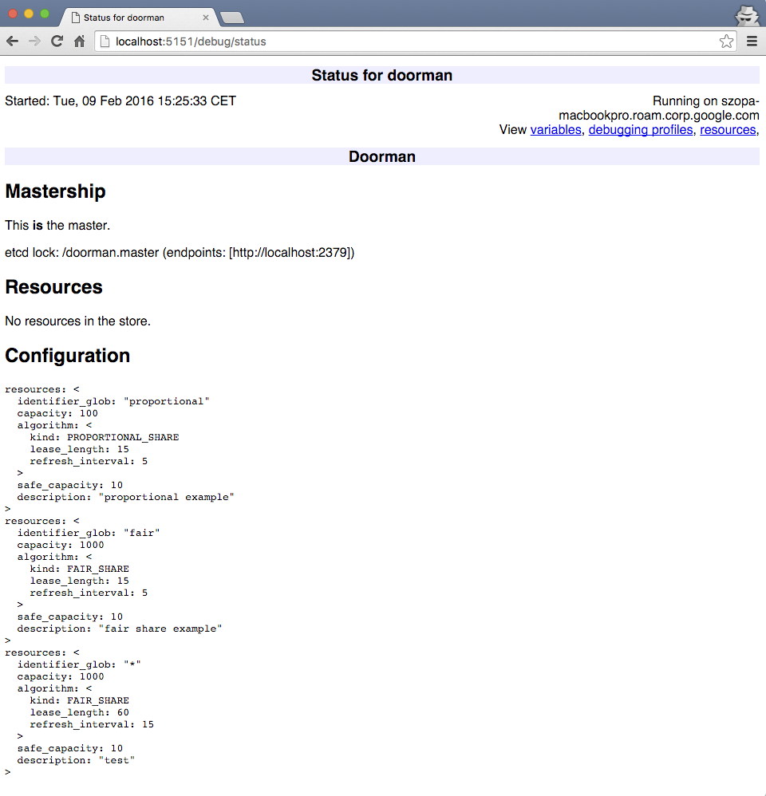

# Simple Doorman Cluster

In this tutorial we'll start a simple cluster consisting of 3 doorman servers. They will perform a leader election among themselves, using an etcd key for synchronization. We'll write a configuration file defining a few resources using different algorithms for capacity sharing. We will use doorman_shell to ask for resources in the name of different clients, and see how the system behaves.

## Prerequisites
### Etcd

[etcd](https://github.com/coreos/etcd) is a [distributed lock manager](https://en.wikipedia.org/wiki/Distributed_lock_manager) that Doorman uses for leader election.

Retrieve and build etcd:

```sh
go get github.com/coreos/etcd
```

### Foreman

[Foreman](https://github.com/ddollar/foreman) allows us to run a bunch of processes defined in a Procfile with one command. To install foreman, do

```sh
sudo gem install foreman
```

### Doorman binaries
```sh
go get github.com/flipkart-incubator/doorman/go/cmd/doorman_shell
go get github.com/flipkart-incubator/doorman/go/cmd/doorman
```

## Preparing the configuration

Doorman's configuration file uses the YAML format. [config.yml](config.yml) sets up 2 resources:

+ `proportional`, which uses the [PROPORTIONAL_SHARE](../algorithms.md#proportional_share) algorithm, with capacity 100.
+ `fair`, which uses the [FAIR_SHARE](../algorithms.md#fair_share) algorithm, with capacity 400.

Note that Doorman's notion of "capacity" is purposefully vague. It's the job of the application to determine what it actually means. A common case is to interpret it as "requests per second" and pass it to a rate limiter.

## Running the cluster

We will use Foreman to start an Etcd service and 3 doorman processes. Take a look at the [Procfile](Procfile). We are using the default etcd port (2379). If that isn't good for you (for example because you have a different etcd installation using that port), please edit the Procfile appropriately.

It should look like this:

```console
$ cd $GOPATH/src/github.com/flipkart-incubator/doorman/doc/simplecluster

$ foreman start
15:14:34 etcd.1    | started with pid 2057
15:14:34 doorman.1 | started with pid 2058
15:14:34 doorman.2 | started with pid 2059
15:14:34 doorman.3 | started with pid 2060
15:14:34 etcd.1    | 2016-02-09 15:14:34.155045 I | etcdmain: etcd Version: 2.2.4
15:14:34 etcd.1    | 2016-02-09 15:14:34.155499 I | etcdmain: Git SHA: GitNotFound
15:14:34 etcd.1    | 2016-02-09 15:14:34.155506 I | etcdmain: Go Version: go1.5.3
15:14:34 etcd.1    | 2016-02-09 15:14:34.155511 I | etcdmain: Go OS/Arch: darwin/amd64
15:14:34 etcd.1    | 2016-02-09 15:14:34.155519 I | etcdmain: setting maximum number of CPUs to 4, total number of available CPUs is 4
15:14:34 etcd.1    | 2016-02-09 15:14:34.155604 N | etcdmain: the server is already initialized as member before, starting as etcd member...
15:14:34 etcd.1    | 2016-02-09 15:14:34.156553 I | etcdmain: listening for peers on http://localhost:2380
15:14:34 etcd.1    | 2016-02-09 15:14:34.156815 I | etcdmain: listening for peers on http://localhost:7001
15:14:34 etcd.1    | 2016-02-09 15:14:34.157151 I | etcdmain: listening for client requests on http://localhost:2379
15:14:34 etcd.1    | 2016-02-09 15:14:34.157405 I | etcdmain: listening for client requests on http://localhost:4001
15:14:34 etcd.1    | 2016-02-09 15:14:34.182646 I | etcdserver: recovered store from snapshot at index 40004
15:14:34 etcd.1    | 2016-02-09 15:14:34.182670 I | etcdserver: name = default
15:14:34 etcd.1    | 2016-02-09 15:14:34.182688 I | etcdserver: data dir = /tmp/etcd.data5000
15:14:34 etcd.1    | 2016-02-09 15:14:34.182695 I | etcdserver: member dir = /tmp/etcd.data5000/member
15:14:34 etcd.1    | 2016-02-09 15:14:34.182700 I | etcdserver: heartbeat = 100ms
15:14:34 etcd.1    | 2016-02-09 15:14:34.182705 I | etcdserver: election = 1000ms
15:14:34 etcd.1    | 2016-02-09 15:14:34.182711 I | etcdserver: snapshot count = 10000
15:14:34 etcd.1    | 2016-02-09 15:14:34.182725 I | etcdserver: advertise client URLs = http://localhost:2379,http://localhost:4001
15:14:34 etcd.1    | 2016-02-09 15:14:34.182789 I | etcdserver: loaded cluster information from store: <nil>
15:14:34 doorman.2 | I0209 15:14:34.244933    2059 doorman_server.go:229] Waiting for the server to be configured...
15:14:34 doorman.2 | I0209 15:14:34.252148    2059 doorman_server.go:233] Server is configured, ready to go!
15:14:34 doorman.1 | I0209 15:14:34.249882    2058 doorman_server.go:229] Waiting for the server to be configured...
15:14:34 doorman.1 | I0209 15:14:34.253541    2058 doorman_server.go:233] Server is configured, ready to go!
15:14:34 doorman.3 | I0209 15:14:34.257818    2060 doorman_server.go:229] Waiting for the server to be configured...
15:14:34 doorman.3 | I0209 15:14:34.264149    2060 doorman_server.go:233] Server is configured, ready to go!
15:14:34 etcd.1    | 2016-02-09 15:14:34.357273 I | etcdserver: restarting member ce2a822cea30bfca in cluster 7e27652122e8b2ae at commit index 44318
15:14:34 etcd.1    | 2016-02-09 15:14:34.359510 I | raft: ce2a822cea30bfca became follower at term 9
15:14:34 etcd.1    | 2016-02-09 15:14:34.359551 I | raft: newRaft ce2a822cea30bfca [peers: [ce2a822cea30bfca], term: 9, commit: 44318, applied: 40004, lastindex: 44318, lastterm: 9]
15:14:34 etcd.1    | 2016-02-09 15:14:34.362005 I | etcdserver: starting server... [version: 2.2.4, cluster version: 2.2]
15:14:34 etcd.1    | 2016-02-09 15:14:34.362453 E | etcdserver: cannot monitor file descriptor usage (cannot get FDUsage on darwin)
15:14:34 doorman.1 | I0209 15:14:34.364562    2058 server.go:420] setting current master to 'localhost:5101'
15:14:34 doorman.2 | I0209 15:14:34.364525    2059 server.go:420] setting current master to 'localhost:5101'
15:14:34 doorman.3 | I0209 15:14:34.364517    2060 server.go:420] setting current master to 'localhost:5101'
15:14:34 doorman.2 | I0209 15:14:34.547623    2059 server.go:420] setting current master to ''
15:14:34 doorman.2 | I0209 15:14:34.548259    2059 server.go:420] setting current master to 'localhost:5101'
15:14:34 doorman.3 | I0209 15:14:34.551920    2060 server.go:420] setting current master to ''
15:14:34 doorman.3 | I0209 15:14:34.552724    2060 server.go:420] setting current master to 'localhost:5101'
15:14:34 doorman.1 | I0209 15:14:34.568854    2058 server.go:420] setting current master to ''
15:14:34 doorman.1 | I0209 15:14:34.569165    2058 server.go:420] setting current master to 'localhost:5101'
15:14:34 doorman.3 | I0209 15:14:34.653314    2060 server.go:420] setting current master to ''
15:14:34 doorman.3 | I0209 15:14:34.654506    2060 server.go:420] setting current master to 'localhost:5102'
15:14:34 doorman.3 | I0209 15:14:34.655259    2060 server.go:420] setting current master to ''
15:14:34 doorman.3 | I0209 15:14:34.655849    2060 server.go:420] setting current master to 'localhost:5102'
15:14:34 doorman.2 | I0209 15:14:34.659346    2059 server.go:420] setting current master to ''
15:14:34 doorman.2 | I0209 15:14:34.659626    2059 server.go:420] setting current master to 'localhost:5102'
15:14:34 doorman.2 | I0209 15:14:34.660032    2059 server.go:420] setting current master to ''
15:14:34 doorman.2 | I0209 15:14:34.660530    2059 server.go:420] setting current master to 'localhost:5102'
15:14:34 doorman.1 | I0209 15:14:34.666386    2058 server.go:420] setting current master to ''
15:14:34 doorman.1 | I0209 15:14:34.666666    2058 server.go:420] setting current master to 'localhost:5102'
15:14:34 doorman.1 | I0209 15:14:34.667027    2058 server.go:420] setting current master to ''
15:14:34 doorman.1 | I0209 15:14:34.667377    2058 server.go:420] setting current master to 'localhost:5102'
15:14:34 etcd.1    | 2016-02-09 15:14:34.763272 I | raft: ce2a822cea30bfca is starting a new election at term 9
15:14:34 etcd.1    | 2016-02-09 15:14:34.763356 I | raft: ce2a822cea30bfca became candidate at term 10
15:14:34 etcd.1    | 2016-02-09 15:14:34.763368 I | raft: ce2a822cea30bfca received vote from ce2a822cea30bfca at term 10
15:14:34 etcd.1    | 2016-02-09 15:14:34.763392 I | raft: ce2a822cea30bfca became leader at term 10
15:14:34 etcd.1    | 2016-02-09 15:14:34.763413 I | raft: raft.node: ce2a822cea30bfca elected leader ce2a822cea30bfca at term 10
15:14:34 etcd.1    | 2016-02-09 15:14:34.764722 I | etcdserver: published {Name:default ClientURLs:[http://localhost:2379 http://localhost:4001]} to cluster 7e27652122e8b2ae
15:14:40 doorman.1 | I0209 15:14:40.364135    2058 server.go:420] setting current master to ''
15:14:40 doorman.2 | I0209 15:14:40.364206    2059 server.go:420] setting current master to ''
15:14:40 doorman.3 | I0209 15:14:40.364233    2060 server.go:420] setting current master to ''
15:14:44 doorman.1 | I0209 15:14:44.769394    2058 server.go:420] setting current master to 'localhost:5100'
15:14:44 doorman.3 | I0209 15:14:44.769510    2060 server.go:420] setting current master to 'localhost:5100'
15:14:44 doorman.1 | I0209 15:14:44.769432    2058 server.go:400] this Doorman server is now the master
15:14:44 doorman.2 | I0209 15:14:44.769685    2059 server.go:420] setting current master to 'localhost:5100'
```

As you can see, one of the doorman servers won the election and become the master. In our session, it is the one using port 5100.

Doorman servers expose their status through a very basic HTTP interface at [/debug/status](http://localhost:5151/debug/status) (change your port to match the ports that your servers are using). (Note: currently gRPC doesn't allow you to use one port to serve both RPCs and HTTP traffic. This is being worked on. As a workaround, doorman exposes a second, debug port to serve HTTP. In the Procfile, we defined it as the RPC port +50.)



## Clients

As the server cluster is running, let's try to exercise it with some clients. Normally each client would be a separate process using the Doorman client library to get rate limitting, etc. However, for the purpose of this tutorial we'd like to be able to get a quick overview of the state of the system. That's why we are going to use [doorman_shell](../../go/cmd/doorman_shell/doorman_shell.go).

```console
$ export PATH=$GOPATH/bin:$PATH # Make sure you have it in your PATH.

$ doorman_shell --server=localhost:5101
> help


This program allows you to interact with a Doorman service. A
successfull command outputs nothing, a failing command will output the
error.

Supported commands:

get CLIENT RESOURCE CAPACITY

  Request CAPACITY of RESOURCE for client. Requesting CAPACITY doesn't
  guarantee receiving it. Call "show" to see the current assingments.

release CLIENT RESOURCE

  Release any capacity for RESOURCE held by client.

show

  Show assignments for known client/resource pairs. Note that due to
  the asynchronous nature of the Doorman API you may not see the
  requested assignments immediately.

help

  Show this information.

```

Let's start with the `proportional` resource. With this algorithm, each user is entitled to an equal share of the resource, and the leftover capacity is distributed proportionally to how much over the user requested.

```console
> get small1 proportional 10
> get small2 proportional 10
> get small3 proportional 10
> get small4 proportional 10
> show
client: "small1"
resource: "proportional"
capacity: 10

client: "small2"
resource: "proportional"
capacity: 10

client: "small3"
resource: "proportional"
capacity: 10

client: "small4"
resource: "proportional"
capacity: 10
```

There's a 100 capacity available, so each client got as much as they requested.

Now let's ask for more.

```console
> get big proportional 500
> show
client: "big"
resource: "proportional"
capacity: 0

client: "small1"
resource: "proportional"
capacity: 10

client: "small2"
resource: "proportional"
capacity: 10

client: "small3"
resource: "proportional"
capacity: 10

client: "small4"
resource: "proportional"
capacity: 10

> show
client: "big"
resource: "proportional"
capacity: 60

client: "small1"
resource: "proportional"
capacity: 10

client: "small2"
resource: "proportional"
capacity: 10

client: "small3"
resource: "proportional"
capacity: 10

client: "small4"
resource: "proportional"
capacity: 10
```

We can see here that *receiving* capacity is decoupled from *asking* for capacity. As we can see here, sometimes it may take a while before the clients receives a new lease.

Let's introduce a `bigger` client, competing for the same capacity as `big`.

```console
> get bigger proportional 1000
> show
client: "big"
resource: "proportional"
capacity: 60

client: "bigger"
resource: "proportional"
capacity: 0

client: "small1"
resource: "proportional"
capacity: 10

client: "small2"
resource: "proportional"
capacity: 10

client: "small3"
resource: "proportional"
capacity: 10

client: "small4"
resource: "proportional"
capacity: 10
```

A moment later:

```console
> show
client: "big"
resource: "proportional"
capacity: 25.454545454545457

client: "bigger"
resource: "proportional"
capacity: 34.54545454545455

client: "small1"
resource: "proportional"
capacity: 10

client: "small2"
resource: "proportional"
capacity: 10

client: "small3"
resource: "proportional"
capacity: 10

client: "small4"
resource: "proportional"
capacity: 10
```

The math is a bit involved, but not really difficult:

+ There's 100 units available, and there's 6 clients. So, every client is entitled to 100/6 ≈ 16.66 units.
+ 4 of those clients only requested 10. That leaves (16.66-10)*4 ≈ 26.64 units on the table.
+ `bigger` requested for twice as much capacity as `big`, so it's entitled to 2/3 of the leftover pool. So, it will get 16.66+26.64*(2/3) ≈ 34.54.
+ This leaves `big` with 16.66+26.64*(1/3) ≈ 25.45.

So far so good. Now, let's try to do a similar experiment with the fair share resource. We will use a separate `doorman_shell` session so that the `proportional` clients don't obscure the view.

```console
$ doorman_shell --server=localhost:5101
> get small1 fair 100
> get small2 fair 100
> get small3 fair 100
> get small4 fair 100
> show
client: "small1"
resource: "fair"
capacity: 100

client: "small2"
resource: "fair"
capacity: 100

client: "small3"
resource: "fair"
capacity: 100

client: "small4"
resource: "fair"
capacity: 100

> get big fair 1000
> show
client: "big"
resource: "fair"
capacity: 600

client: "small1"
resource: "fair"
capacity: 100

client: "small2"
resource: "fair"
capacity: 100

client: "small3"
resource: "fair"
capacity: 100

client: "small4"
resource: "fair"
capacity: 100
```

There's not enough capacity for `big`, so he gets all of the leftover pool. However, here comes `bigger`:

```console
> get bigger fair 2000
> show
client: "big"
resource: "fair"
capacity: 600

client: "bigger"
resource: "fair"
capacity: 0

client: "small1"
resource: "fair"
capacity: 100

client: "small2"
resource: "fair"
capacity: 100

client: "small3"
resource: "fair"
capacity: 100

client: "small4"
resource: "fair"
capacity: 100
```

Initially, `bigger` got nothing: all capacity is being used. We'll have to take capacity from other clients to give it something. The `small*` clients requested less than their are guaranteed, so we won't be taking for them. This means that `big` must give. However, Doorman won't take capacity from it immediately - `big` may be still using the capacity right now. We'll have to wait till its lease expires.

```console
> show
client: "big"
resource: "fair"
capacity: 300

client: "bigger"
resource: "fair"
capacity: 0

client: "small1"
resource: "fair"
capacity: 100

client: "small2"
resource: "fair"
capacity: 100

client: "small3"
resource: "fair"
capacity: 100

client: "small4"
resource: "fair"
capacity: 100

> show
client: "big"
resource: "fair"
capacity: 300

client: "bigger"
resource: "fair"
capacity: 300

client: "small1"
resource: "fair"
capacity: 100

client: "small2"
resource: "fair"
capacity: 100

client: "small3"
resource: "fair"
capacity: 100

client: "small4"
resource: "fair"
capacity: 100
```

And now, both `big` and `bigger` received 300 capacity units.
